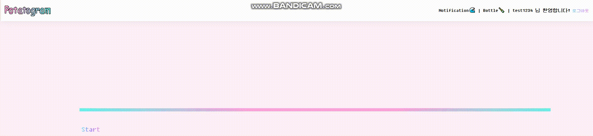

<h2>🔎 프로젝트 정보</h2>

<b>📆 2023.09.08 ~ 2023.09.15 (7일)</b>

더조은컴퓨터아카데미 두 번째 개인 프로젝트.

[PDF 다운로드](React_Project_윤나연.pdf)

 
 
<h2>✨ 프로젝트 소개</h2>

2023년 9월 8일부터 9월 15일까지 진행한 미니프로젝트는 Node.js와 React를 이용하여 SNS 사이트를 제작하고, 사용자의 신선한 경험을 위해 미니게임과 랭킹 시스템을 추가한 개인 프로젝트였습니다.

 
 
<h2>🛠 Stacks</h2>

   
   
  
   
  
   
   
  
   
   
  
  

 
 
<h2>⚙ 기능 구현</h2>
<ul>
<li>로그인</li>
<li>회원 가입</li>
<li>포스트 작성  - 해쉬 태그, 파일 첨부 구현</li>
<li>댓글 작성 </li>
<li>검색 시스템 - 해쉬 태그, 닉네임, 유저 아이디로 검색 가능</li>
<li>프로필 수정 - 바이오, 닉네임, 프로필 사진 수정 가능</li>
<li>좋아요 기능 - 좋아요, 좋아요 누른 피드 확인 가능</li>
<li>팔로우 기능</li>
<li>미니게임</li>
  
  
  
<li>랭킹 시스템</li>
</ul>
 
